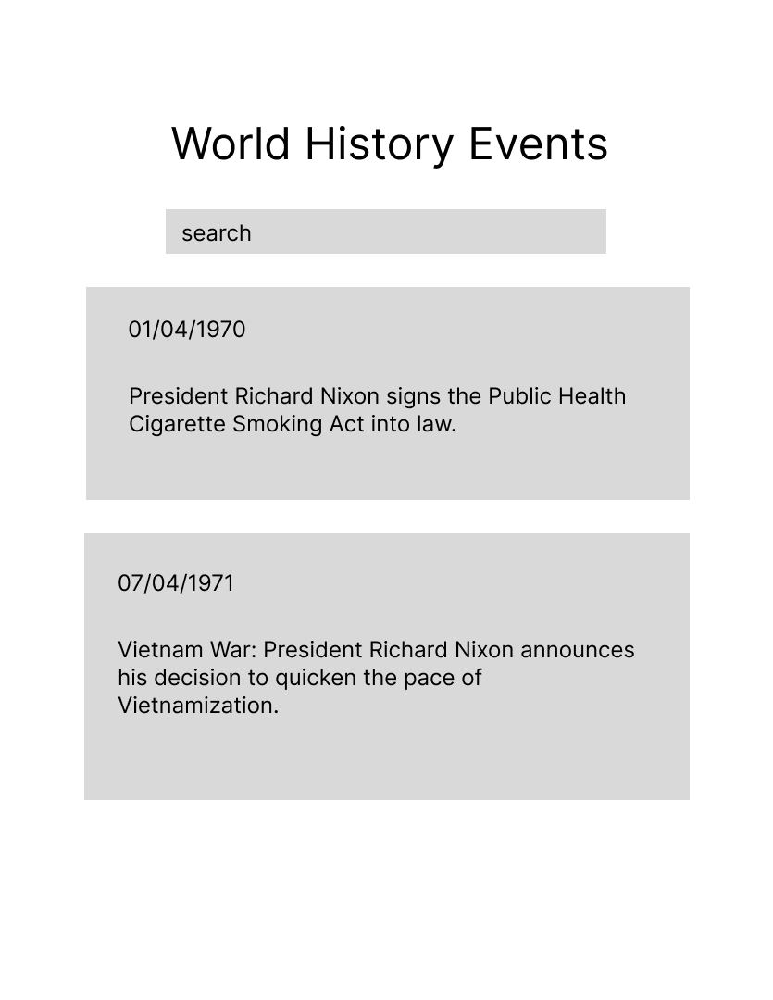
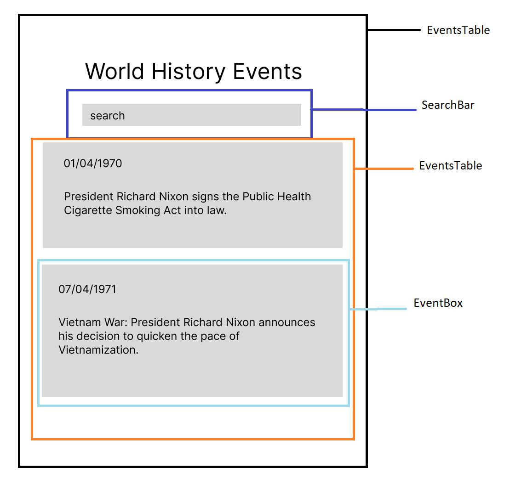

# World History Events React app
:)
Allows users to search for world history events. Returns up to 10 cards with the event and the date.

Check it live [here](https://world-history-events.netlify.app/).

## Data:
Data will be sourced from [Historical Events API](https://api-ninjas.com/api/historicalevents). It returns 
up to 10 events that match search parameters. 

### example of the JSON data:
```
[
  {
    "year": "1964",
    "month": "01",
    "day": "09",
    "event": "Martyrs' Day: Several Panamanian youths try to raise the Panamanian flag in the U.S.-controlled Panama Canal Zone, leading to fighting between U.S. military and Panamanian civilians."
  },
  {
    "year": "1855",
    "month": "01",
    "day": "28",
    "event": "A locomotive on the Panama Canal Railway runs from the Atlantic Ocean to the Pacific Ocean for the first time."
  },
  {
    "year": "1904",
    "month": "05",
    "day": "04",
    "event": "The United States begins construction of the Panama Canal."
  }
]
```

## Wireframe:



## Components:

There are three components on the app:  
1. **EventsApp**: contains the entire app.
-  **SearchBar**: received user input. -**no longer a separate component, during development it was designed as part of the root App component**
2. **EventsTable**: contains all historical events results.
3. **EventBox**: displays one historical event.




Components hierarchy: 

1. **EventsApp**: contains the entire app
    1. **SearchBar**: received user input -**no longer a separate component, during development it was designed as part of the root App component**
    2. **EventsTable**: contains all historical events results
        1. **EventBox**: displays one historical event
